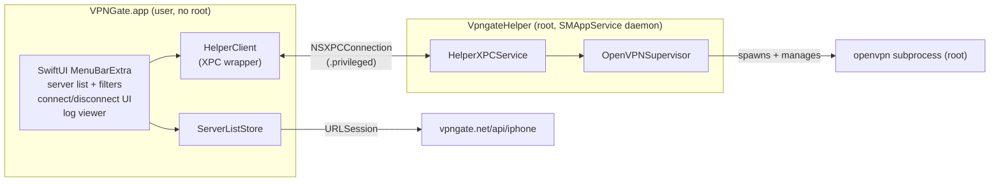
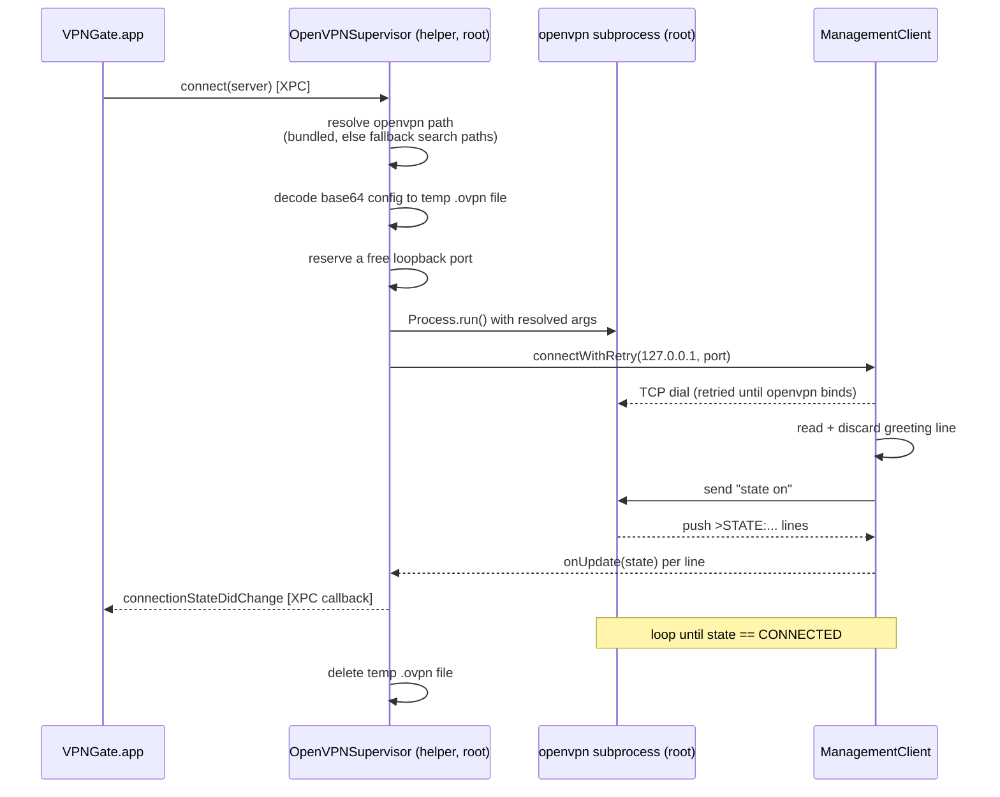

# Architecture

The following describes how VPNGate works at runtime on macOS.

## Process model

Two processes split by privilege, talking over XPC:

## Server list

`ServerListStore` fetches the CSV server list from
`vpngate.net/api/iphone/`, and `ServerListDecoder` parses it: strips
the `*vpn_servers` header marker and trailing `*` marker, strips
embedded quotes, then maps each row onto `Server` by column name
(order-independent). The decoded list is cached at
`~/Library/Caches/vpngate/servers.json` with a 24-hour TTL
(`ServerListCache`); a fetch failure keeps whatever's already loaded
and surfaces an error instead of clearing the list.

## The OpenVPN wrapper

`OpenVPNSupervisor` (in `Helper/`) owns one `openvpn` subprocess and
its management-interface connection at a time. Connecting walks
through these steps:

## Logging

Persistent logs are appended to `/Library/Application Support/Vpngate/daemon.log`.
