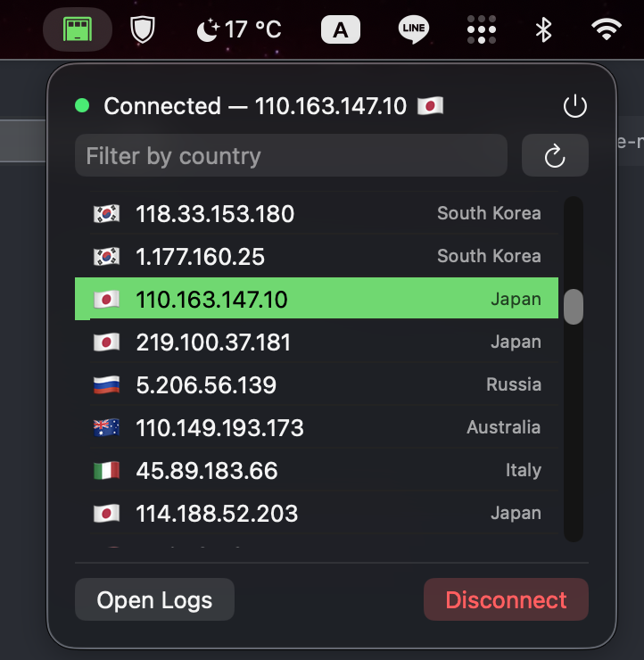

# VPNGate for macOS

A native menu bar client for [vpngate.net](https://vpngate.net). Fetches the public VPNGate
server list, lets you pick a server and connect/disconnect via a
privileged background helper that runs OpenVPN, and shows live status
and logs.



## Installing

Requires macOS 14 (Sonoma) or later. VPNGate is a universal build
(arm64 + x86_64), so it runs natively on both Apple Silicon and Intel
Macs.

### Installation

This build is signed with a free Apple Development certificate, not a
paid Developer ID, so it is **not notarized**. macOS Gatekeeper will
flag it as being from an unidentified developer. To run it anyway:

1. Either run `brew install --cask davegallant/public/vpngate-mac`, or unzip `VPNGate.zip` and move `VPNGate.app` to `/Applications`.
2. Open it once — Gatekeeper will refuse and offer no immediate bypass
   in the dialog.
3. Go to **System Settings → Privacy & Security**, scroll to the
   security notice about `VPNGate.app`, and click **Open Anyway**.
4. Confirm in the dialog that appears.

Alternatively, from Terminal: `xattr -d com.apple.quarantine /Applications/VPNGate.app`

The first time you open the app, it registers a privileged background
helper (`com.davegallant.vpngate.helper`) to run OpenVPN — macOS will
prompt you to approve it under **System Settings → General → Login
Items & Extensions**. Approve it once; no further prompts are needed
after that. After any rebuild that changes `Helper/`, the running
daemon needs a manual restart since overwriting the app bundle doesn't
restart an already-running launchd daemon:

```sh
sudo launchctl kickstart -k system/com.davegallant.vpngate.helper
```

## Building

Requires Xcode (not just Command Line Tools) and a free Apple ID
(Personal Team is enough — no paid Developer Program needed).

```sh
just package
```

Produces `build/VPNGate.zip`. `xcodebuild -exportArchive` isn't used
(a free/personal Apple ID has no distribution profiles to resolve an
export method against) — the script copies the signed `.app` straight
out of the archive instead.

## Architecture

See [ARCHITECTURE.md](ARCHITECTURE.md) for more technical details.
